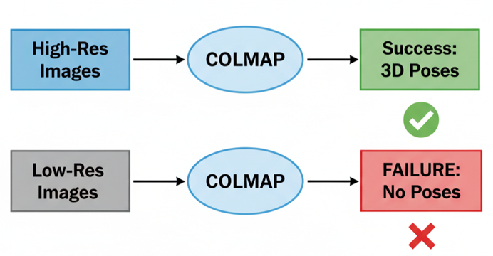
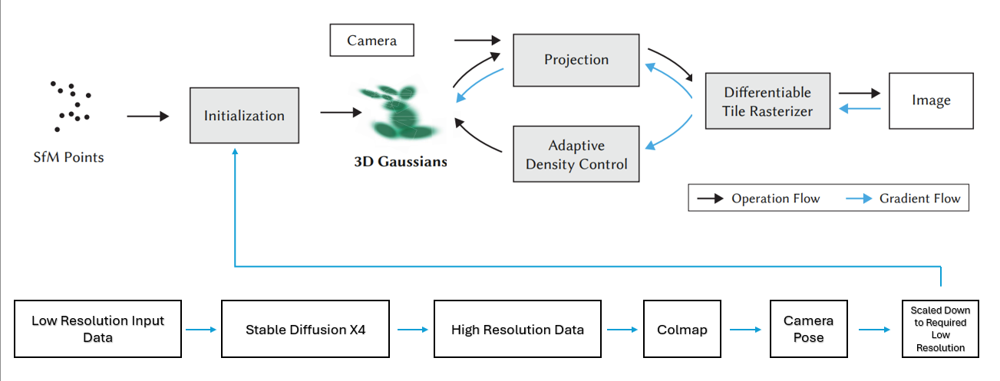
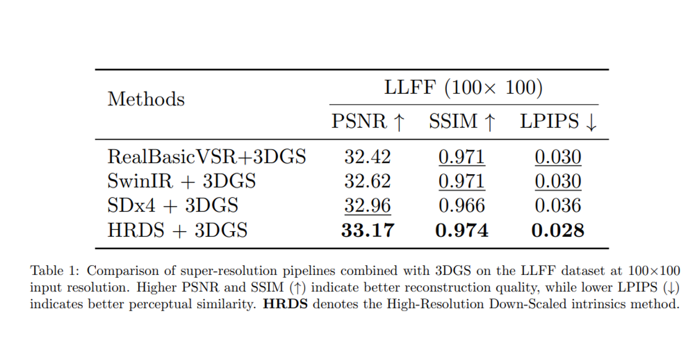
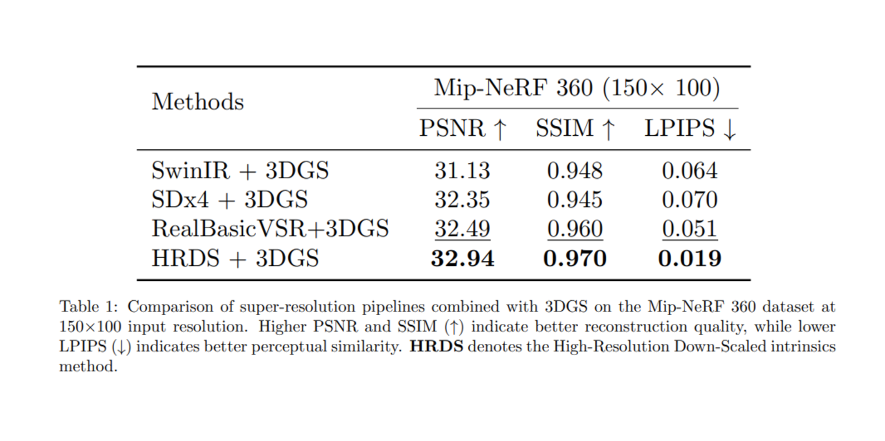
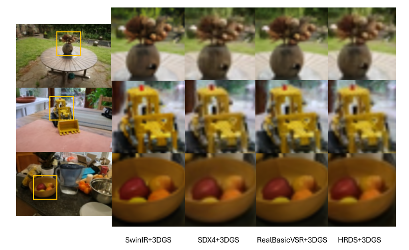

  <h1>Splatting the Unsplattable: Making 3D Gaussian Splatting Work with Low-Res Images</h1>

  

    

  <table style="margin: 0 auto; border: none; background-color: transparent;">
    <tr style="border: none; background-color: transparent;">
      <td align="center" style="border: none; background-color: transparent; padding-right: 30px;">
        <strong>Omkar Mayekar</strong> 
        Clemson University 
        <a href="mailto:omayekar@clemson.edu">omayekar@clemson.edu</a>
      </td>
      <td align="center" style="border: none; background-color: transparent; padding-left: 30px;">
        <strong>Vinay Rajolu</strong> 
        Clemson University 
        <a href="mailto:vrajolu@clemson.edu">vrajolu@clemson.edu</a>
      </td>
    </tr>
  </table>

   

  

    <strong>CPSC 8810 - Machine Learning-based Image Synthesis</strong> 
    Final Project 
    Fall 2025
  

> **Abstract:** Imagine trying to reconstruct a detailed 3D model of a dinosaur skeleton, but you are only allowed to look at it through a pair of foggy, low-quality glasses. This is essentially the problem facing modern robotics and super-resolution tasks when using **3D Gaussian Splatting (3DGS)**.
>
> In this project, we explore why the current state-of-the-art 3D tools fail on low-resolution data, and we present our final project method: a pipeline that uses **Generative AI** to "hallucinate" the missing details needed to kickstart the 3D training process.

---

## 1. The Problem: The "COLMAP" Bottleneck

3D Gaussian Splatting has taken the computer vision world by storm, offering real-time rendering speeds and high-quality visuals. However, it has a critical dependency: **It needs to know exactly where the camera was looking for every picture you took.**

To figure out these camera positions (poses), 3DGS relies on a classic tool called **COLMAP**. COLMAP works by finding "features"—distinct points like corners or edges—and matching them across different photos (Structure from Motion).

**Here is the catch:** When you feed COLMAP low-resolution images (e.g., 100x100 pixels), it fails.

*Figure 1: The COLMAP failure case on low-resolution inputs.*

As shown above, purely low-res images don't have enough distinct pixels for COLMAP to lock onto. It returns "No Poses," and the 3DGS training crashes before it even begins. This is a major blocker for robotics or drones that might stream low-bandwidth video but still need to build a 3D map.

## 2. Related Work: Why hasn't this been solved?

Most existing research in Radiance Fields (like NeRFs and 3DGS) assumes you have beautiful, high-definition datasets. The standard pipeline looks like this:

1. Input High-Res Images
2. Run COLMAP to get Point Cloud & Poses
3. Train 3DGS

There are currently no established methods specifically designed to handle low-resolution initialization for 3DGS. While super-resolution techniques exist (making small images big), they haven't been successfully integrated into a pipeline that accurately recovers the camera physics needed for 3DGS to work on the original low-quality data.

Our project fills this gap by marrying **Super-Resolution (AI Upscaling)** with **3D Gaussian Splatting**.

## 3. Our Approach: The Upscale-Pose-Downscale Pipeline

We proposed a novel pipeline to bypass the resolution limit. The core idea is simple but effective: *If the image is too blurry for COLMAP, let's fake the details so COLMAP thinks it's looking at a high-res image.*

*Figure 2: The proposed Upscale-Pose-Downscale pipeline.*

### Step-by-Step Algorithm

1. **Input:** Low-Resolution Images (e.g., 100x75) which act as our ground truth.
2. **Upscaling:** We use advanced Super-Resolution models (like **Stable Diffusion X4**) to upscale the images by 4x (to 400x300).
3. **Pose Estimation:** We run `colmap2nerf.py` on these upscaled images. Because the images are now larger and sharper, COLMAP successfully finds features and generates camera poses.
4. **Intrinsics Downscaling:** **(Crucial Step)** We cannot use the poses exactly as they are because they correspond to a 400x300 image. We mathematically scale down the camera intrinsics (focal length, center points) to match our original 100x75 resolution.
5. **3DGS Training:** We initialize the 3D Gaussian Splatting training using these downscaled poses and the *original* low-res images.

This allows us to train a 3D scene that is faithful to the original data, even though we used "hallucinated" high-res data to find the camera positions.

## 4. Experiments: Battle of the Upscalers

To test this, we evaluated our pipeline on two distinct datasets with different characteristics:

1.  **LLFF Dataset:** Standard forward-facing scenes downscaled to a tiny **100x100 resolution**.
2.  **Mip-NeRF 360 Dataset:** Complex, unbounded 360-degree scenes downscaled to **150x100 resolution**.

We compared three different upscaling technologies to see which one helped COLMAP the most:
* **RealBasicVSR:** A video super-resolution model.
* **SwinIR:** A standard image restoration model.
* **Stable Diffusion X4 (SDx4):** A generative model that can "dream" up realistic textures.

We also established a **"Gold Standard" baseline called HRDS (High-Resolution Down-Scaled)**. This represents the best possible scenario: calculating poses from the actual high-res photos and then downscaling them.

### Quantitative Results

We measured the quality of the final 3D renders using **PSNR (Peak Signal-to-Noise Ratio)**. Higher is better.

#### **Dataset 1: LLFF Results (100x100)**

In the standard LLFF scenes, the generative approach won out:
1.  **SDx4 + 3DGS** achieved a PSNR of **32.96**.
2.  This was significantly better than RealBasicVSR (32.42) and SwinIR (32.62).
3.  Most importantly, SDx4 came incredibly close to the HRDS "Perfect" Baseline (33.17).

#### **Dataset 2: Mip-NeRF 360 Results (150x100)**

We observed a different trend when moving to the more complex, unbounded scenes in the Mip-NeRF 360 dataset.

As shown in the table above:
1.  **RealBasicVSR + 3DGS** achieved the highest accuracy with a PSNR of **32.49**, beating SDx4 (32.35).
2.  **SwinIR** lagged behind significantly at 31.13 PSNR.
3.  RealBasicVSR was the closest to the HRDS baseline (32.94).

**Analysis:** We believe RealBasicVSR performs better here because Mip-NeRF 360 scenes require high temporal/spatial consistency across many views, which video upscalers (like RealBasicVSR) are specifically designed to handle better than single-image generators like SDx4.

### Qualitative Results

Numbers are great, but 3DGS is visual. Let's look at the renders.

#### **Visuals: LLFF Dataset**

*Figure 3: Visual comparison on LLFF dataset. SDx4 (middle/bottom rows) produces sharp, coherent 3D geometry.*

#### **Visuals: Mip-NeRF 360 Dataset**

*Figure 4: Visual comparison on Mip-NeRF 360 dataset.*

For complicated scenes (like the tractor and garden shown above), **RealBasicVSR** produced results that were perceptually sharper and closer to the ground truth compared to SDx4 and SwinIR.

## 5. Conclusion & Future Work

We successfully demonstrated that you don't need native high-resolution images to train a 3D Gaussian Splat model. By intelligently upscaling images to generate camera poses and then correctly downscaling the intrinsics, we can recover high-fidelity 3D scenes from low-res inputs.

**Key Takeaway:** 3DGS fails on low-res inputs because of COLMAP, not because of the Splatting algorithm itself. Fixing the pose estimation fixes the pipeline.

### Future Directions
* **Robotics:** We plan to test this on noisy, real-world drone footage where bandwidth is limited.
* **Denoising:** We will use image denoisers for noisy input images before giving them to COLMAP for pose estimation. COLMAP often fails on noisy images even if the resolution is good, so this is a critical next step.

---

### References
* **RealBasicVSR:** [Chan et al., 2021](https://arxiv.org/pdf/2111.12704)
* **SwinIR:** [Liang et al., 2021](https://arxiv.org/pdf/2108.10257)
* **Stable Diffusion X4:** [Hugging Face](https://huggingface.co/asoderznik/sdx4-upscaler)
* **3D Gaussian Splatting:** [Kerbl et al., SIGGRAPH 2023](https://arxiv.org/pdf/2308.04079)
* **COLMAP:** [Schonberger et al.](https://colmap.github.io/)
